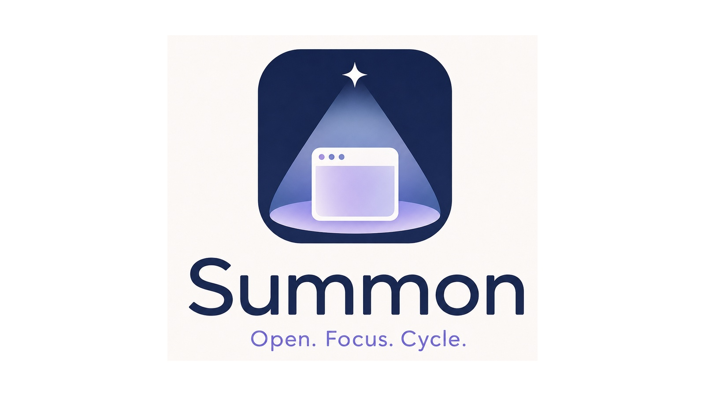

<p align="center">
  
</p>

<h1 align="center">Summon</h1>

<p align="center">
  <strong>Open, focus, and cycle macOS apps from your keyboard.</strong>
</p>

<p align="center">
  <a href="#installation">Install</a> · <a href="#quick-start">Quick Start</a> · <a href="#usage">Usage</a> · <a href="#configuration">Configuration</a>
</p>

---

Summon is a tiny macOS command-line tool for keyboard-driven app switching.

Define your applications in `~/.config/summon/summon.toml`, wire them to your preferred hotkey tool, and use one command to launch, focus, or cycle through app windows.

```sh
summon terminal
summon browser
summon editor
```

Summon is designed to be fast, boring, and easy to keep in your dotfiles.

## Installation

```sh
cargo install summon
```

## Quick Start

Create `~/.config/summon/summon.toml`:

```toml
[settings]
cycle_when_focused = true
launch_if_not_running = true

[bindings.terminal]
app = "com.mitchellh.ghostty"

[bindings.browser]
app = "com.brave.Browser"

[bindings.editor]
app = "dev.zed.Zed"
```

Wire to your hotkey tool (e.g. [skhd](https://github.com/koekeishiya/skhd)):

```
cmd + alt + ctrl + shift - return : summon terminal
cmd + alt + ctrl + shift - b      : summon browser
cmd + alt + ctrl + shift - z      : summon editor
```

## Usage

```sh
summon <binding>        # Launch, focus, or cycle the configured app
summon app <app>        # Summon an app directly by name or bundle ID
summon list             # List all configured bindings
summon config path      # Print the active config file path
summon config check     # Validate the config file
summon doctor           # Check macOS permissions
```

## Configuration

Summon reads from `$XDG_CONFIG_HOME/summon/summon.toml` (defaults to `~/.config/summon/summon.toml`).

Each binding maps a name to an application target:

```toml
[bindings.terminal]
app = "com.mitchellh.ghostty"
cycle_when_focused = true
launch_if_not_running = true
```

Applications can be resolved by bundle identifier, name, or path:

```toml
[bindings.terminal]
app = "com.mitchellh.ghostty"    # Bundle ID (preferred)

[bindings.preview]
app = "Preview"                   # App name

[bindings.custom]
app = "/Applications/My App.app"  # Path
```

## How it works

1. Resolve the configured target application
2. If not running — launch it
3. If running but not focused — focus its most recent window
4. If already focused and `cycle_when_focused` is enabled — cycle to the next window

This makes repeated keypresses useful rather than redundant.

## Integrations

Summon works with any tool that can execute a command. Example configs are in the [`examples/`](examples/) directory.

### skhd

Add to `~/.skhdrc`:

```
hyper - return : summon terminal
hyper - b      : summon browser
hyper - z      : summon editor
hyper - f      : summon finder
```

See [`examples/skhdrc`](examples/skhdrc) for a complete example.

### Raycast

Copy the script commands from [`examples/raycast/`](examples/raycast/) to your Raycast scripts directory:

```sh
cp examples/raycast/summon-*.sh ~/.config/raycast/scripts/
```

### Shell aliases

Add to `~/.zshrc` or `~/.bashrc`:

```sh
alias st='summon terminal'
alias sb='summon browser'
alias se='summon editor'
```

See [`examples/shell-aliases.sh`](examples/shell-aliases.sh) for more.

### Other tools

Summon also works with [Karabiner-Elements](https://karabiner-elements.pqrs.org/), [Hammerspoon](https://www.hammerspoon.org/), [Alfred](https://www.alfredapp.com/), and [AeroSpace](https://github.com/nikitabobko/AeroSpace). Any tool that can run a shell command can invoke `summon <binding>`.

## License

Apache-2.0
